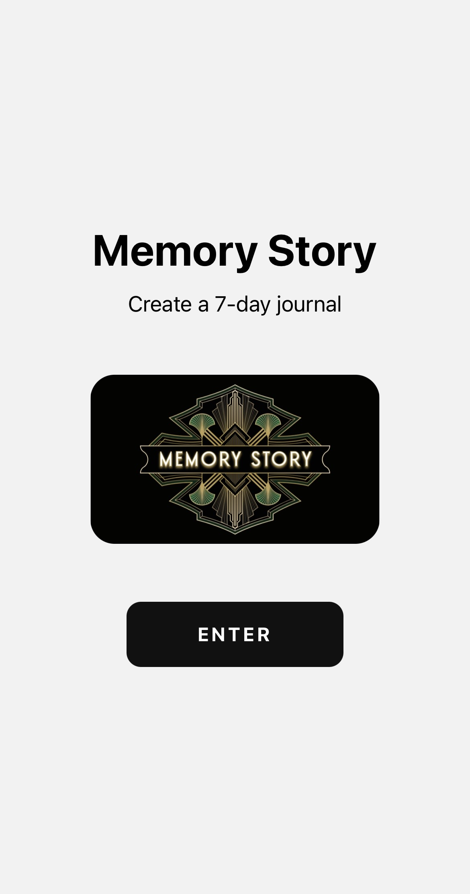
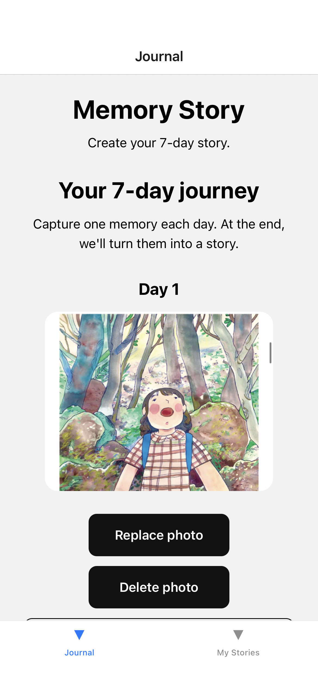
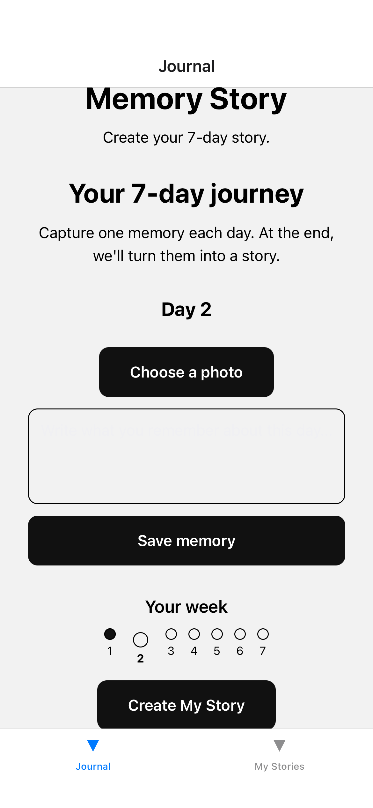
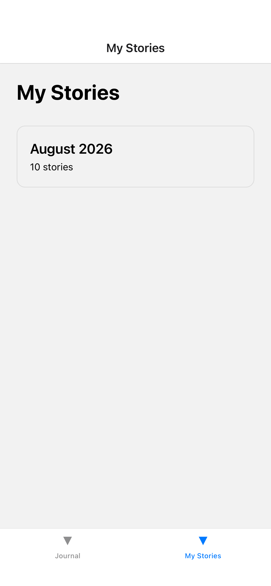
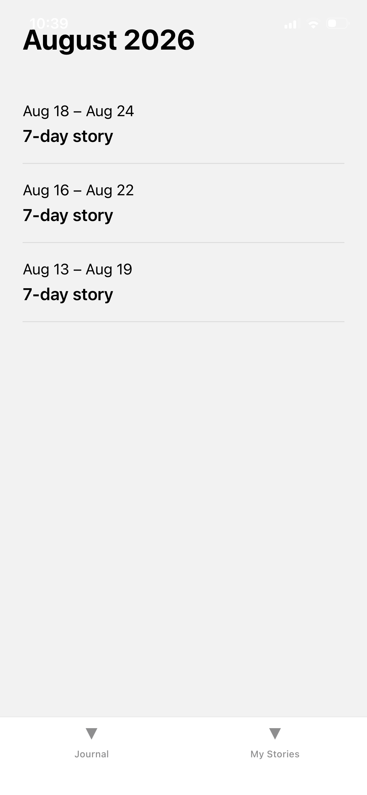
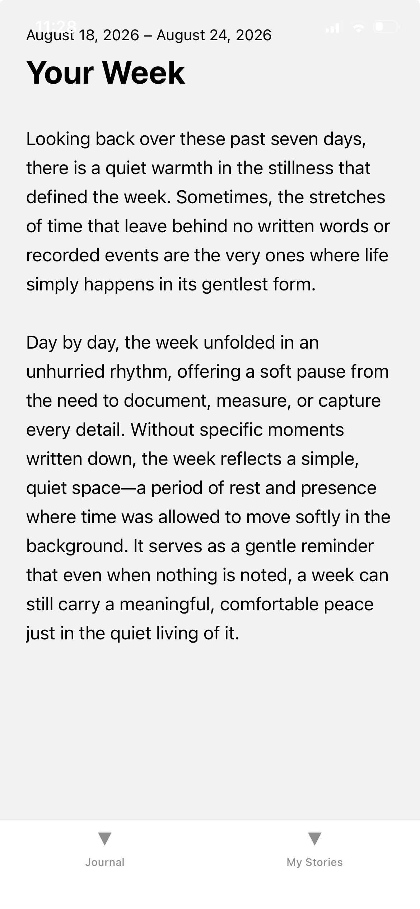

# 📖 Memory Story

> Turn your everyday memories into stories worth remembering.

**Memory Story** is a personal journaling app that helps you capture moments throughout the week and transform them into a meaningful weekly story.

Instead of keeping isolated notes and photos, Memory Story brings your memories together into a single narrative that you can revisit later.

---

## ✨ Features

- 🔐 User authentication with Supabase
- 📔 Create and manage a 7-day journal
- ✍️ Add memories to individual days
- 📷 Add photos to daily memories
- 🖼️ View photos alongside journal entries
- 🤖 Generate a story from the week's memories
- 💾 Store journals, memories, stories, and photos with Supabase
- 📚 Browse completed stories
- 🗓️ Organize stories by month
- 📅 Organize stories by week
- 📖 Read individual weekly stories
- 🔄 Continue journaling with a new week after completion

---

## 📱 App Flow

```text
              Sign Up / Sign In
                     │
                     ▼
              Start a Journal
                     │
                     ▼
              7 Daily Memories
                     │
              ┌──────┴──────┐
              │             │
              ▼             ▼
           Add Text      Add Photos
              │             │
              └──────┬──────┘
                     │
                     ▼
              Complete the Week
                     │
                     ▼
              Generate Story
                     │
                     ▼
                 My Stories
                     │
              ┌──────┴──────┐
              ▼             ▼
            Month          Week
                            │
                            ▼
                       Full Story
```

---

## 🖼️ Demo

<p align="center">
  
  
  
</p>

<p align="center">
  
  
  
</p>

---

## 🛠️ Tech Stack

### Frontend

- React Native
- Expo
- Expo Router
- TypeScript

### Backend

- Supabase
- PostgreSQL
- Supabase Storage
- Supabase Authentication

### Other Technologies

- React Native Image Picker
- Expo Image
- AsyncStorage
- React Native Reanimated

---

## 📂 Project Structure

```text
memory-story/
│
├── assets/
│   └── images/
│       ├── memory-story-logo.png
│       └── demo/
│           ├── demo-1.jpg
│           ├── demo-2a.png
│           ├── demo-2b.PNG
│           ├── demo-3.PNG
│           ├── demo-4.PNG
│           └── demo-5.png
│
├── src/
│   ├── app/
│   │   ├── (app)/
│   │   │   ├── journal.tsx
│   │   │   ├── month.tsx
│   │   │   ├── stories.tsx
│   │   │   ├── week.tsx
│   │   │   └── _layout.tsx
│   │   │
│   │   ├── (auth)/
│   │   │   ├── sign-in.tsx
│   │   │   ├── sign-up.tsx
│   │   │   └── _layout.tsx
│   │   │
│   │   ├── index.tsx
│   │   └── _layout.tsx
│   │
│   ├── components/
│   │   ├── CurrentStory.tsx
│   │   ├── GenerateStoryButton.tsx
│   │   ├── JournalDayCard.tsx
│   │   ├── JournalDays.tsx
│   │   ├── MemoryEditor.tsx
│   │   └── PhotoActions.tsx
│   │
│   ├── hooks/
│   │   ├── use-auth.ts
│   │   ├── use-color-scheme.ts
│   │   └── use-theme.ts
│   │
│   ├── lib/
│   │   └── supabase.ts
│   │
│   ├── services/
│   │   ├── journalService.ts
│   │   ├── photoService.ts
│   │   └── storyService.ts
│   │
│   └── styles/
│       └── indexStyles.ts
│
└── README.md
```

---

## 🚀 Getting Started

### Prerequisites

Make sure you have installed:

- Node.js
- npm
- Expo CLI / Expo tooling
- A Supabase project
- iOS Simulator, Android Emulator, or Expo Go

### 1. Clone the repository

```bash
git clone https://github.com/habib-868/memory-story.git
cd memory-story
```

### 2. Install dependencies

```bash
npm install
```

### 3. Configure environment variables

Create a `.env` file in the project root:

```env
EXPO_PUBLIC_SUPABASE_URL=your_supabase_url
EXPO_PUBLIC_SUPABASE_PUBLISHABLE_KEY=your_supabase_publishable_key
```

Do not commit your `.env` file or private credentials to GitHub.

### 4. Start the application

```bash
npx expo start
```

Then open the application using:

- iOS Simulator
- Android Emulator
- Expo Go
- Development build

---

## 🗄️ Supabase

Memory Story uses Supabase for:

- Authentication
- PostgreSQL database
- Journal storage
- Daily memory storage
- Story storage
- Photo storage

The application separates active journals from completed journals so that completed memories can become permanent stories while the user continues with a new journal.

---

## 🧠 How Memory Story Works

Each journal represents one week.

During the week, the user can:

1. Open the current journal.
2. Add a memory for each day.
3. Attach photos to memories.
4. Continue adding memories throughout the week.
5. Complete the journal.
6. Generate a story from the collected memories.
7. Save the completed story.
8. Start a new journal.

Completed stories can then be explored through the **My Stories** section.

Stories are organized by:

```text
My Stories
    │
    ├── August 2026
    │      ├── Week 1
    │      ├── Week 2
    │      └── Week 3
    │
    └── September 2026
           └── Week 1
```

---

## 🗺️ Current Development Status

### Completed

- [x] Authentication
- [x] Supabase integration
- [x] Weekly journal structure
- [x] Seven-day memory flow
- [x] Memory editing
- [x] Photo selection
- [x] Photo storage
- [x] Weekly story generation
- [x] Completed journal handling
- [x] Stories section
- [x] Stories grouped by month
- [x] Stories grouped by week
- [x] Individual story viewing
- [x] New journal after completion
- [x] Demo screenshots
- [x] Basic project cleanup

### In Progress / Planned

- [ ] UI/UX refinement
- [ ] Reduce code redundancy
- [ ] Improve loading states
- [ ] Improve error handling
- [ ] Improve story presentation
- [ ] Add richer story browsing
- [ ] Performance optimization
- [ ] Production testing
- [ ] App Store / Play Store release preparation

---

## 🔮 Future Ideas

Possible future improvements include:

- 🎨 More polished visual design
- 🌙 Dark mode
- 🔍 Search through memories and stories
- ❤️ Favorite stories
- 🏷️ Story tags
- 📤 Export stories
- 📄 Generate PDF memories
- ☁️ Better media management
- 🔔 Journal reminders
- 📆 Calendar-based memory browsing
- ✨ More advanced AI-generated storytelling

---

## 👨‍💻 Author

**HABIBULLAH**

📧 habibullaharyan159@gmail.com

🐙 GitHub: https://github.com/habib-868

💼 LinkedIn: https://www.linkedin.com/in/md-habibullah-743594207/

---

## 📄 License

This project is currently developed as a personal project.

---

## ❤️ About the Project

Memory Story started with a simple idea:

> Memories are easier to forget when they stay as scattered notes and photos.

Memory Story turns those individual moments into a story — something that can be read, remembered, and revisited later.

**Capture the moment. Tell the story. Remember the week.**